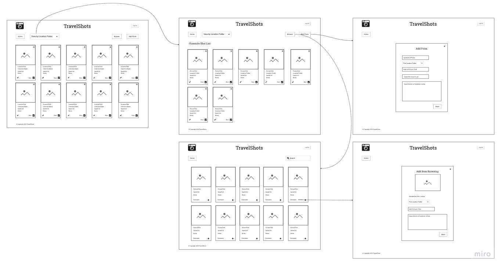

# TravelShots
-Front-End Capstone project designed to demonstrate what I learned during the first 3 months at Nashville Software School. This project was completed in two weeks using HTML, CSS, Javascript, and React. I use Cloudinary API to store and manage photos uploaded by the user. The Cloudinary image link and additional data is stored on a JSON server. Styled with Semantic UI. TravelShots- my a photo shoot shot list creator for traveling photographers.

This project was bootstrapped with [Create React App](https://github.com/facebook/create-react-app).

## Start JSON Server
Go to api folder.
json-server -p 8088 -w database.json

on main folder
npm i --save react-router-dom
## Available Scripts

In the project directory, you can run:

### `npm start`

Runs the app in the development mode. 
Open [http://localhost:3000](http://localhost:3000) to view it in the browser.

